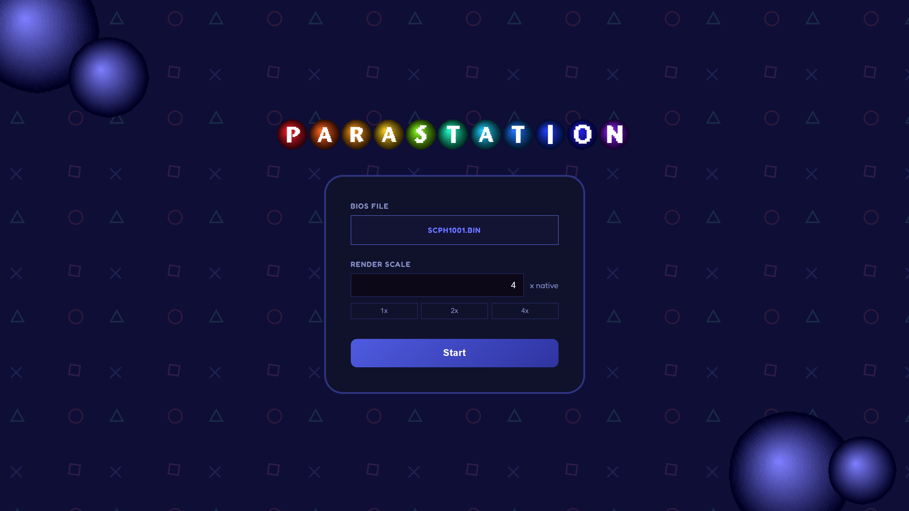
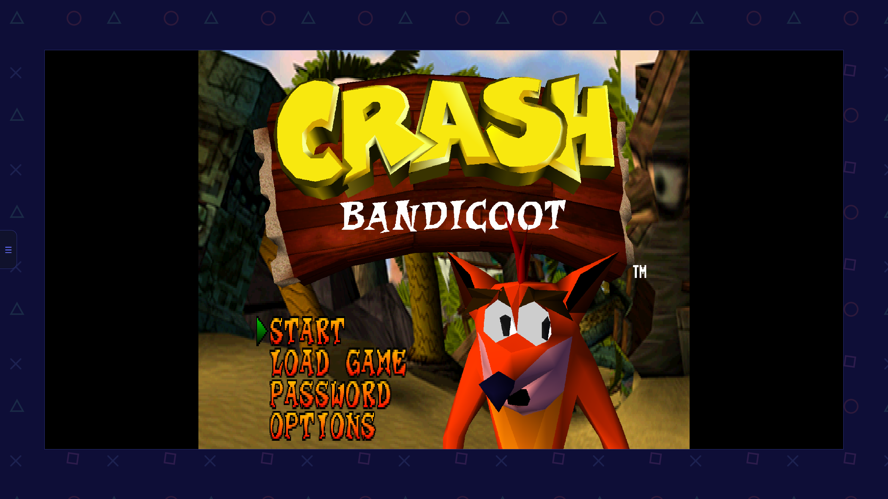
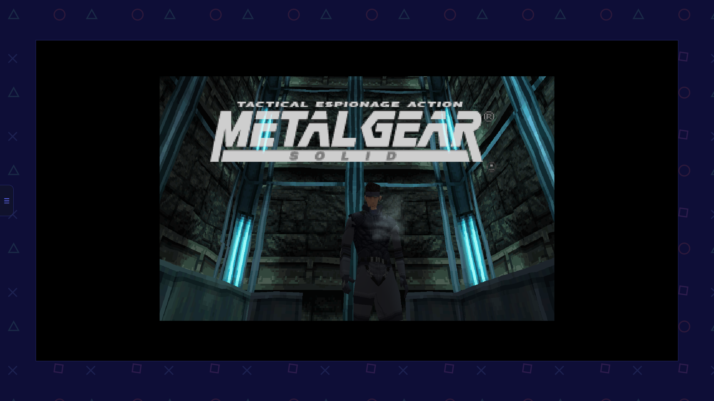
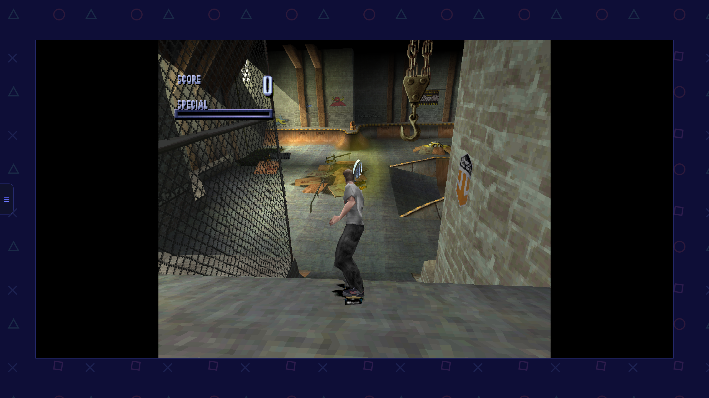

# 

ParaStation is a PSX core written in Rust, with example frontends for desktop (OpenGL) and a web-based (WASM + WebGL) site. The main core has no external crate dependencies and exposes platform-agnostic functionality and a simple interpreter for the CPU backend.

The project was my opportunity to learn some Rust and use its ecosystem as well as learn more about the Playstation. Most of its functionality is implemented, but formal game compatibility and accurate timings were not tested. The web-based frontend is hosted on [GitHub pages](https://parallaxerror.github.io/parastation/), however you must supply your own PS1 BIOS and games in the .cue+.bin format.

## Crate Overview
ParaStation consists of three crates:
- `parastation-core`: a platform-agnostic library with no external crate dependencies, defining frontend traits for an implementation and encapsulating the Playstation's core behaviour
- `parastation-frontend`: a desktop-based frontend using OpenGL, used mostly to test the core's functionality
- `parastation-web`: A web based site targeting WebAssembly with a JavaScript harness to handle I/O and a WebGL backend using `glow`

## Screenshots
<table>
  <tr>
    <td></td>
    <td></td>
  </tr>
  <tr>
    <td></td>
    <td></td>
  </tr>
</table>

## AI Declaration
The main purpose of the project was as a learning experience for writing idiomatic Rust and learning more about the PS1's architecture. Most of the core functionality was written by hand, and sites and emulators used as reference are linked in the file headers. To inform my architectural choices and learn good Rust practices, I used Claude as a guide to get feedback on  the overall project architecture and learn common practices and patterns used in Rust projects. I wasn't terribly interested in learning the setup for the I/O crates and web design, so the `parastation-web` HTML+CSS+JS stack and some crate glue like the SPU backend were generated with AI. The file headers disclose if any files were generated with AI, however Copilot autocomplete was used for most files.
